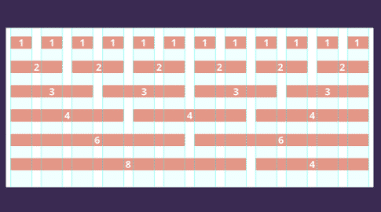
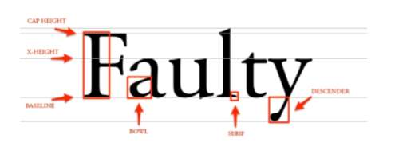
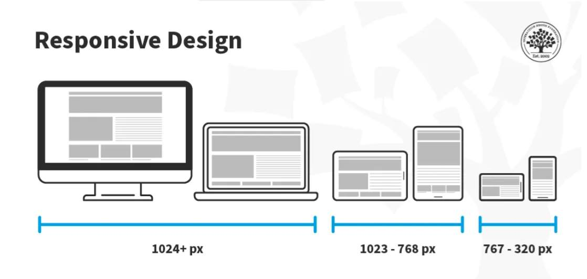
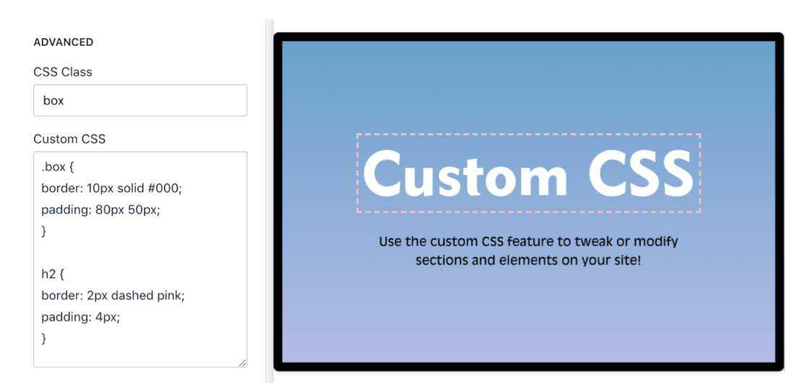
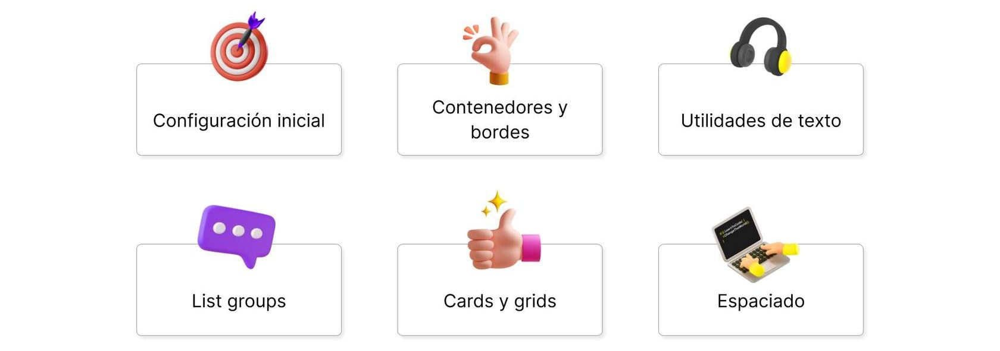

> # ***Modulo 2 - Clase 3: FrameworksCSS_***

> ## ***Objetivos***

* ### *Identificar qué es un framework de CSS.*

* ### *Conocer algunas de las opciones de CSS más empleadas y explicar sus ventajas y desventajas.*

* ### *Aprender a implementar Bootstrap.*

> ## ***Frameworks CSS***

* ### **¿Qué es?**
  
  En términos generales, un framework es un conjunto de código que proporciona una estructura para facilitar el desarrollo de software.  
  Este conjunto favorece al desarrollo porque ofrece componentes reutilizables, estilos predefinidos y una serie de utilidades que agilizan el proceso de construcción de interfaces de usuario.

* ### **CSS (Cascading Style Sheets)** 
  
  Es el lenguaje que define el aspecto y la presentación de las páginas. Funciona como un conjunto de reglas que indican cómo se deben estilizar los elementos HTML en un sitio web. Esto incluye desde el cambio de colores y fuentes hasta la disposición de los elementos en pantalla.

* ### **¿Por qué utilizar frameworks?**
  
  * #### ***Componentes reutilizables*** 
    
    Los frameworks de CSS suelen incluir una variedad de componentes predefinidos, como botones, barras de navegación, tarjetas, formularios y más. Los desarrolladores pueden utilizar estos componentes directamente en sus proyectos sin la necesidad de escribir todo el código desde cero.  
  
    

  * #### ***Grid System*** 
    
    Muchos frameworks incorporan diseños fluidos y responsivos. Estos sistemas dividen la interfaz en columnas y filas, proporcionando una estructura flexible que se adapta a diferentes tamaños de pantalla de los dispositivos.  
  
    

  * #### ***Tipografía y estilos básicos*** 
    
    Los frameworks a menudo definen estilos básicos para tipografía, colores, imágenes y otros elementos clave. Esto proporciona una apariencia estándar en todo el sitio y ahorra tiempo en la configuración manual de estos estilos.  

    

  * #### ***Responsiveness*** 
    
    Muchos frameworks están diseñados con la responsividad en mente, utilizando técnicas como clases específicas y medias queries. Estas últimas permiten cambiar los estilos en un HTML a partir del tamaño de la pantalla de un dispositivo.  

    

  * #### ***Personalización*** 
    
    Aunque los frameworks ofrecen estilos predeterminados, la mayoría permite la personalización de los mismos. Los desarrolladores pueden ajustar colores, tipografía y otros estilos para que se alineen con la identidad visual única del proyecto.  
    
    

> ## ***Frameworks más utilizados***

* ### **Bulma** 
    
    Es un framework de CSS basado en Flexbox que se centra en la simplicidad y la flexibilidad. Permite crear código más sencillo de entender y mantener a medida que crece, para facilitar la implementación de interfaces responsivas y componentes individuales. Bulma no depende de JavaScript y permite una personalización fácil y rápida mediante el uso de variables. Conoce la documentación de ***[Bulma](https://bulma.io/documentation/)***.
  
  * #### **Ventajas**
    1. ***Facilidad de uso:*** Facilita la implementación rápida de una tabla con estilos atractivos.

    2. ***Enfoque responsivo:*** Las tablas se adaptarán fácilmente a diferentes tamaños de pantalla.

    3. ***Flexible y personalizable:*** Apariencia de tabla adaptable de acuerdo a tus necesidades.

  * #### **Desventajas**
    1. ***Limitaciones en la personalización avanzada:*** Para estilos muy específicos.
    
    2. ***Curva de aprendizaje:*** Puede abrumar a principiantes.
    
    3. ***Archivos grandes:*** Debido a conjuntos completos de componentes y estilos. Esto puede afectar el rendimiento de la página

* ### **Foundation** 
    
    Es un framework de desarrollo web responsivo y avanzado que utiliza un sistema de rejilla flexible y componentes personalizables. Es modular y permite a los desarrolladores elegir solo los componentes que necesitan. También ofrece un conjunto de herramientas bastante amplio y está diseñado para adaptarse a una gran variedad de proyectos, desde pequeños sitios web hasta aplicaciones a nivel empresarial. Conoce más de ***[Foundation](https://get.foundation/sites/docs/)***.
  
  * ***Una ventaja... es altamente personalizable:*** Foundation es altamente modular y permite a los desarrolladores seleccionar solo los componentes que necesitan. Esto facilita la creación de diseños personalizados.

  * ***Una desventaja... curva de aprendizaje:*** Debido a su nivel de complejidad y variedad de opciones, Foundation puede tener una curva de aprendizaje más pronunciada para los principiantes.

* ### **Materialize** 
    
    Es un framework de CSS diseñado por Google basado en el diseño de Material Design, proporcionando una apariencia moderna y consistente. Materialize incluye una variedad de componentes, como barras de navegación, tarjetas, y modales, de la misma manera que proporciona funcionalidades adicionales como animaciones y efectos. Consulta más sobre la documentación de ***[Materialize](https://materializecss.com/)***.  
  
  * ***Una ventaja... diseño moderno y consistente:*** Materialize sigue las pautas de diseño de Material Design, ofreciendo una apariencia moderna y coherente. Es ideal para proyectos que buscan el aspecto y la sensación de Material Design.

  * ***Una desventaja... dependencia de JavaScript:*** Algunos de los componentes de Materialize dependen de JavaScript, lo que puede aumentar la complejidad y los requisitos de rendimiento.  

  ***Nota:*** Material Design es un sistema de diseño desarrollado por Google que se utiliza para proporcionar una interfaz de usuario coherente y visualmente atractiva en plataformas y dispositivos diversos.

* ### **Tailwind CSS** 
    
    Adopta un enfoque diferente al proporcionar utilidades a nivel de código en lugar de componentes predefinidos. Hace uso de los estilos in-line aplicados directamente a los elementos HTML, permitiendo una gran flexibilidad y personalización. Tailwind es conocido por su enfoque orientado a clases (uso del atributo class en las etiquetas) y su capacidad para trabajar bien con estructuras de diseño más complejas y personalizadas. Échale un vistazo a la documentación de ***[TailwindCSS](https://v2.tailwindcss.com/docs)***.
  
  * ***Una ventaja... altamente personalizable y bajo nivel:*** Tailwind permite un alto grado de personalización y control directo sobre los estilos mediante clases in-line. Es ideal para aquellos que prefieren un enfoque más bajo nivel.

  * ***Una desventaja... curva de aprendizaje inicial:*** Para quienes no están familiarizados con su enfoque basado en clases, Tailwind puede tener una curva de aprendizaje inicial elevada. También puede requerir una configuración más extensa para proyectos más grandes.

* ### **Como puedes ver...** 
  
  Las opciones son muy variadas. Todas son igual de útiles y la elección dependerá de las habilidades del equipo de desarrollo. Dicho esto, vamos a introducir un último framework de desarrollo el cual destaca por su versatilidad, facilidad de uso y amplia adopción en la comunidad de desarrollo web... estamos hablando de Bootstrap.

> ## ***Bootstrap***

* ### **¿Qué es?**
  
  Bootstrap es un framework de código abierto y colaborativo para la creación de componentes responsivos como botones, alertas, barras de navegación, banners, entre otros. Así, simplifica considerablemente el proceso de estilización de aplicaciones. 

  Fue desarrollado por X (ex twitter) y se convirtió rápidamente en uno de los frameworks de desarrollo frontend más populares. Actualmente, empresas grandes de la industria como LinkedIn o Spotify lo usan como base en sus aplicaciones y páginas web.

* ### **Ventajas de trabajar con Bootstrap**
  
  * ***Diseño responsive:*** Fue creado como framework para diseño mobile, pero se adapta de forma automática al diseño de aplicaciones de escritorio.

  * ***Interfaces:*** Sus componentes y estilos predefinidos facilitan la creación de interfaces de usuario de manera rápida y eficiente.

  * ***Compatibilidad browsers:*** Bootstrap es soportado por la mayoría de navegadores y sistemas operativos.

  * ***Plugins JS:*** Existen componentes dinámicos que tienen integrada una funcionalidad desarrollada con JS (modales, caruseles, dropdowns), pero puede trabajar con o sin este lenguaje.

  * ***Personalizable:*** Los componentes predefinidos pueden personalizarse con el preprocesador Sass que agrega nuevas características y funcionalidades.

* ### **Utilidades y componentes en [Boostrap](https://getbootstrap.com/docs/4.1/getting-started/introduction/)**
  
  Dentro de Bootstrap existen muchos tipos de componentes que pueden ser utilizados para definir la estructura y diseño de nuestra página.
  
  * #### ***Contenedores y bordes***
    
    Uno de los componentes fundamentales de Bootstrap son los contenedores. Estos envuelven y alinean el contenido de la página web dependiendo del dispositivo donde se visualiza. Normalmente se usan en etiquetas **main** o **div**.  
    
    Para incorporar un contenedor podemos utilizar la clase container dentro de la etiqueta objetivo. Lo que ocurrirá será que los elementos dentro de este tag serán agrupados y alineados dentro del contenedor.  

    Luego de hacerlo, puedes intentar modificar el tamaño de la ventana con el cursor. Verás que el contenedor ya es responsive y adapta sus elementos al tamaño correspondiente. Asimismo, estos pueden ser anidados dentro de otros contenedores limitando el espacio de cada sección dentro del mismo.  

    Las clases de bordes nos permiten modificar el estilo, radio y color de los bordes de un elemento dentro de la página de forma sencilla y rápida. Agreguemos bordes a algunos elementos de la página empezando por el header dando únicamente un borde inferior de tipo primario. Este tipo primario será un color, ya preestablecido por Bootstrap, cargado y listo para usar.

  * #### ***Utilidades de texto***  
    
    Las utilidades de texto son herramientas que nos permiten ajustar el tamaño de letra, la alineación, el ancho, estilo, etc.

  * #### ***Listas***
    
    1. Dentro de las utilidades preconstruidas de Bootstrap, encontramos las listas.

    2. Son elementos flexibles que nos permiten generar listados responsivos, que pueden ser personalizados y, también, contener cualquier tipo de información.

    3. Para utilizarlas solo es necesario definir el tag de lista padre con la clase list-group y el resto de los elementos individuales de la lista son marcados como ítems utilizando list-group-item.

  * #### ***Cards & Grids***
    
    Uno de los primeros obstáculos con los que se encuentran los desarrolladores al trabajar con estilos es la creación de cuadrículas de contenido. Es decir, la presentación de múltiples elementos dentro de un recuadro donde todos estos tienen la misma distribución en forma de tarjetas independientes.
    
    
    
    Ya sabemos que cuando utilizamos CSS podemos lograr esto utilizando flex o grid. Pero, en el caso de Bootstrap, contamos con algunas opciones prediseñadas que simplifican el proceso de creación de estos elementos. Para ello solo es necesario buscar en la documentación el tipo de grid y tarjeta que mejor se acomoda a nuestro proyecto...

  * #### ***Espaciado***
    
    Bootstrap incluye algunas clases para agregar márgenes, padding o interlineado de forma sencilla.
***
> ## ***Cierre***

* ### **En conclusión...**

  * ***En esta clase hemos comprendido qué son los frameworks de CSS:*** Bootstrap, Bulma, Foundation, Materialize y Tailwind CSS, han demostrado ser indispensables para los desarrolladores, proporcionando soluciones elegantes y rápidas para los desafíos comunes del diseño web.

  * ***Hemos observado cómo cada Framework:*** Tiene sus propias fortalezas y enfoques, permitiéndonos elegir la herramienta más adecuada según los requisitos del proyecto y nuestras preferencias personales.

  * ***Aprendimos que la implementación de un Framework de CSS:*** No sólo acelera el proceso de desarrollo, sino que además ofrece un conjunto coherente de reglas y estilos que garantizan la uniformidad visual en toda nuestra aplicación. La capacidad de crear interfaces responsive, usar componentes reutilizables y diseños atractivos con relativa facilidad.

  
***