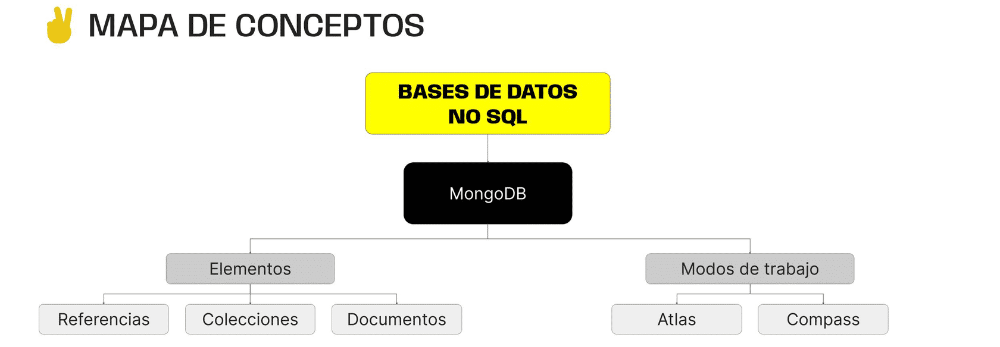

> # ***Modulo 2 - Clase 10: MongoDB***

> ## ***Objetivos***

* ### *Introducir a las Bases de Datos NoSQL con un enfoque específico en MongoDB.*

* ### *Destacar las características distintivas y su relevancia.*                                

* ### *Explorar las herramientas esenciales, MongoDB Atlas y MongoDB Compass.*

> ## ***MongoDB***

* ### **¿Qué es?**

    SQL (Structured Query Language) es el lenguaje que se utiliza para trabajar en bases de datos. Ahora, cuando nos referimos a que estamos trabajando con NoSQL, estamos hablando de bases de datos que no utilizan este lenguaje.

* ### **Estructura de datos**

    MongoDB es un sistema de bases de datos NoSQL. Almacena datos en forma de documentos. Esto quiere decir que, en lugar de almacenar los datos en tablas, utiliza un formato llamado BSON (Binary JSON) el cual a grandes rasgos es una representación binaria de objetos en formato JSON y mapas.

    Cuenta con diferentes interfaces de usuario y aplicaciones que permiten ver la información dentro de la base de datos de forma sencilla.

    A pesar de ser una herramienta con costo, tiene opciones para trabajar sin necesidad de realizar ningún pago. Es excelente para aplicaciones con bases de datos pequeñas.

* ### **Características principales**

    1. Utiliza un esquema dinámico. Trabaja con estructuras (documentos y colecciones) que pueden ser modificadas de forma dinámica.

    2. BSON es un formato creado por MongoDB específicamente para mejorar la eficiencia en la transferencia de datos. Este es una serialización binaria (no legible por humanos).

        #### **BSON**
        ```bson
        \x16\x00\x00\x00
        \x02
        nombre\x00
        \x04\x00\x00\x00Juan\x00
        \x10
        edad\x00
        1E\x00\0x0\0x0\0x0\
        x02 
        ciudad \x 0 0 
        xE \ x 0 0 \ x 0 0 Ejemplovill e \ x 0 0 \
        ```

        #### **JSON**
        ```json
        {
          "nombre": "Juan",
          "edad": 30,
          "ciudad": "Ejemplovill"
        }
        ```

       #### ***Nota:*** Ten en cuenta que la serialización no se ve así realmente. Es solo par hacernos una idea de la diferencia entre BSON y JSON.

> ## ***Elementos principales***

* ### **Conceptos clave**
  
    * ***Documentos:*** Un documento es la unidad básica de almacenamiento. Por ejemplo, si guardamos la información específica de un sólo usuario o un producto, ese conjunto de datos sería considerado un documento. Está representado en formato BSON y contiene pares de campos (clave-valor) similares a los objetos JavaScript.

        **Los valores de las claves pueden ser cualquier tipo de dato como strings, arrays, objetos, números, etc.**

        ```json
        {
          "_id": ObjectId("5f8f58d4f46c6e8b9b395c"),
          "nombre": "Juan Perez",
          "correo": "juan.perez@email.com",
          "direcciones": [
            {
              "tipo": "casa",
              "ciudad": "Ciudad de México",
              "calle": "Calle Principal 123"
            },
            {
              "tipo": "trabajo",
              "ciudad": "Guadalajara",
              "calle": "Avenida Secundaria 456"
            }
          ]
        }
        ```

        * ***_id:*** Cada documento contiene un objeto denominado "_id" que actúa como un identificador único dentro de una colección. Este identificador facilita el acceso y búsqueda a los documentos.
        
        * ***campos:*** "nombre" y "correo" son campos simples que contienen datos como strings y números.
        
        * ***Direcciones:*** Es un campo que contiene un array de objetos. Cada uno representando una dirección con un tipo, ciudad y calle.  
        Estos objetos, a su vez, podrían ser otros documentos a los cuales se hace referencia dentro del documento usuario.

    * ***Colecciones:*** Otro de los elementos principales de MongoDB son las colecciones. Una colección es un conjunto de documentos almacenados que se encuentran relacionados entre sí. Siguiendo el ejemplo anterior del usuario, una colección de usuarios se vería de la siguiente manera. 

        ```json
        
        // Colección: usuarios 
        [
          {
            "_id": ObjectId("5f8d3ac11c5e8a001fec6a7"),
            "nombre": "Juan Perez",
            "correo": "juan@example.com",
            "edad": 30,                                     // Documento: usuario1
            "direccion": {
              "calle": "Calle Principal",
              "ciudad": "Ciudad A",
              "pais": "Pais X"
            }
          },

          {
            "_id": ObjectId("5f8d3ac11c5e8a001fec6a8"),
            "nombre": "Ana Gomez",
            "correo": "ana@example.com",
            "edad": 25,                                     // Documento: usuario2                             
            "direccion": {
              "calle": "Avenida Central",
              "ciudad": "Ciudad B",
              "pais": "Pais Y"
            }
          }
        ]
        ```

  * ***Referencias:*** En muchas situaciones vamos a querer crear algo llamado referencia entre documentos. Las referencias son una "conexión" que hay entre dos documentos que dice que uno de ellos puede abarcar la información del otro.

    ```json
    {
      "_id": ObjectId("5f8f58d4f46c6e8b9b395c1"),
      "nombre": "Laura Martinez",
      "correo": "laura.martinez@email.com",
      "edad": 29,
      "mascota": ObjectId("5f8f58d4f46c6e8b9b395c2") //Hace referencia al _id de la mascota
    }
    ```

    **La propiedad “mascota” del Usuario es el “id” del documento de la mascota.**

    ```json
    {
      "_id": ObjectId("5f8f58d4f46c6e8b9b395c2"),
      "nombre": "Rocky",
      "especie": "Perro",
      "edad": 5
    }
    ```

> ## ***Atlas***

* ### **[MongoDB Atlas](https://www.mongodb.com/atlas/database)**

    MongoDB Atlas es la plataforma de base de datos en la nube ofrecida por MongoDB. En otras palabras, es un servicio online para trabajar con MongoDB.

    Una de sus características fundamentales es que permite deployar de manera sencilla nuestra base de datos. Además, ofrece la capacidad de escalamiento horizontal de manera automática. También realiza respaldos automáticos regulares y permite la recuperación de datos en caso de pérdida o errores.

> ## ***Compass***

* ### **[MongoDB Compass](https://www.mongodb.com/try/download/compass)**

    Ya sabemos que el Atlas nos permitirá administrar una base de datos en la nube. Ahora, conoceremos una nueva herramienta llamada MongoDB Compass que será la interfaz mediante la cuál podremos trabajar con la base de datos de la nube.
***
> ## ***Cierre***

* ### **En conclusión...**

  * ***Hemos conocido las bases de datos NoSQL:*** Con enfoque especial en MongoDB. Comprendimos por qué elegimos bases de datos NoSQL, reconociendo su flexibilidad y adaptabilidad para gestionar grandes volúmenes de datos con estructuras dinámicas.

  * ***Conocimos los elementos principales de MongoDB:*** Documentos, colecciones y referencias, y cómo estos se relacionan entre sí. Aprendimos a utilizar MongoDB Atlas, la plataforma en la nube de MongoDB, para gestionar y desplegar nuestras bases de datos en entornos en la nube. Además descargamos e instalamos MongoDB Compass, una interfaz gráfica que nos permite explorar y manipular datos de manera visual. Conectamos Compass a nuestro cluster en MongoDB Atlas.

  
***