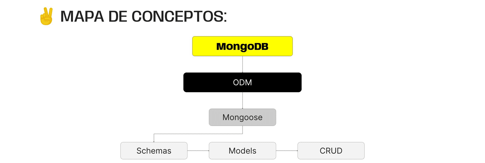

> # ***Modulo 2 - Clase 11: Mongoose***

> ## ***Objetivos***

* ### *Comprender y gestionar la navegación por rutas en una aplicación de React.*

* ### *Aplicar React Router Dom (v6) para gestionar la navegación.*

* ### *Aplicar el manejo de errores en rutas no encontradas.*

> ## ***ODM***

* ### **¿Qué es?**

    Los ODM (Object Data Modeling) son librerías que permiten manipular y convertir datos que son incompatibles naturalmente entre dos sistemas. De esta manera, un programador trabajando dentro del código del servidor puede crear elementos en la base de datos sin necesidad de cambiar el lenguaje.

> ## ***Mongoose***

* ### **¿Qué es?**

    Esta biblioteca fue creada específicamente para el modelado de objetos de MongoDB con node, lo que quiere decir que está desarrollada para ser utilizada con JavaScript o TypeScript. Para utilizar esta herramienta tenemos que seguir algunos pasos y tener en claro las reglas y los patrones de código generales.

> ## ***Schemas & Models***

* ### **Schema: ¿Qué es?**

    En mongoose, un schema es un objeto que podemos crear en nuestro código, el cuál llevará la configuración de una colección.

    Por ejemplo, si quisiéramos crear una colección en MongoDB para guardar información de distintos perros, tenemos que crear un schema sobre perros.

* ### **Configuraciones de un [Schema](https://mongoosejs.com/docs/schematypes.html)**

    Pensemos primero en qué información sobre nuestros perros quisiéramos guardar. Por ejemplo: su nombre, la raza, su color y la edad. Todos estos datos deberán ir guardados dentro del schema. De esta forma, este objeto le dirá a la colección qué tipo de documentos podremos guardar dentro de él.

    Cuando definimos cuáles serán los datos que queremos guardar en la colección, tendremos que definir qué tipo de dato vamos a guardar en cada propiedad de un documento.

    ```javascript
    const mongoose = require('mongoose');
    const Schema = mongoose.Schema;

    // Definición del schema de Usuario
    const userSchema = new Schema({
    name: {
        type: String,
        required: true // Este campo es obligatorio
    },
    age: {
        type: Number,
        unique: true // No se pueden repetir emails
    },
    isActive: {
        type: Boolean,
    }
    });
    ```

    Por ejemplo, sabemos que la propiedad nombre será de tipo string. La edad será de tipo number. Incluso podríamos crear una propiedad llamada isActive para saber si el usuario está o no bloqueado. Esta dato será un booleano.

* ### **Model: ¿Qué es?**

    Un modelo es un objeto basado en un schema que nos permite interactuar con una colección específica en MongoDB. Es una palabra clave que nos ayudará a realizar operaciones CRUD (Create, Read, Update, Delete) en la base de datos.

    En otras palabras, el modelo sería un objeto que utilizará la planilla creada por el Schema con el que podremos modificar la base de datos.

* ### **Definición de modelos**

    Sigamos con el ejemplo de schema de un usuario que vimos anteriormente. Como ya dijimos, el schema es un objeto que simplemente definirá qué propiedades tendrá una colección. Ahora bien, **¿Cómo podemos declarar un modelo a partir de ese schema?**

    Sencillo. Crearemos una variable llamada "User" a partir del método model del objeto mongoose, este tomará dos argumentos... 
    
    1. #### Un string, que debe ser el nombre del modelo con el que queremos trabajar.
    
    2. #### El schema que hayamos creado anteriormente.
    
    ```javascript
    // Creación del modelo Usuario basado en el schema definido

    const User = moongose.model("User", userSchema);
    ```

* ### **Ambas estructuras son diferentes pero complementarias entre sí. Tienen una relación simbiótica (una depende de la otra).**

  * #### ***El schema define la estructura de los documentos.***

  * #### ***El modelo utiliza el schema para proporcionar un objeto con el que podremos interactuar con la base de datos.***
***
> ## ***Cierre***

* ### **En conclusión...**

  * ***Aprendimos qué es un ODM:*** Y cómo estas herramientas pueden ayudarnos a realizar la gestión de información con una base de datos desde nuestro servidor. En este caso hemos revisado y puesto en práctica el ODM mongoose.

  * ***Aprendimos inicializar su Configuración:*** Dentro de node así como también definir los elementos que requerimos para realizar la transferencia de información (schemas y modelos). Estos nos ayudan a construir las estructuras de datos dentro de las cuales se almacenará la información.

  * ***Realizamos la integración de Mongoose con Express:*** Para poder gestionar la información de la base de datos en nuestro servidor por medio de solicitudes de HTTP.

  
***