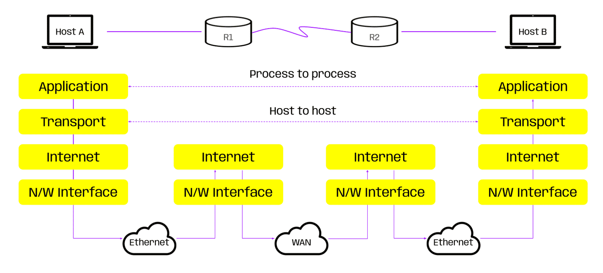
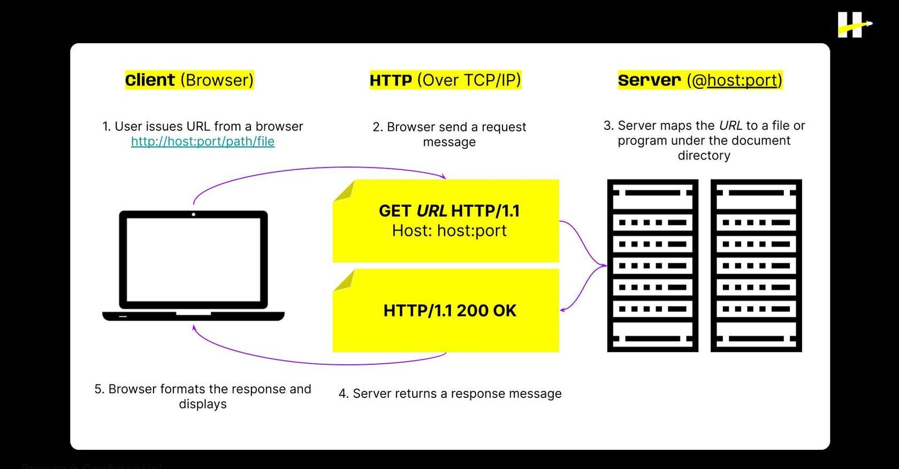

> # ***Modulo 2 - Clase 1: Proyecto FullStack***

> ## ***Objetivos***

* ### *Definir la estructura general de un proyecto full stack.*

* ### *Comprender el protocolo HTTP.*

* ### *Aplicar los principales métodos HTTP.*

> ## ***FrontEnd***

* ### **¿Qué es?**

    Nos referimos a **FrontEnd** como un pedazo de la aplicación que solo seenfoca en la interacción con lo usuarios. De este lado, el objetivo es presentar información útil, definirla visualización de datos y gestionar las interacciones de este con la aplicación.

* ### **Tecnologías comunes**
  
  * ***Lenguajes:*** Sintaxis de código que nos permite escribir instrucciones que pueden ser ejecutadas por un ordenador. Aquí podemos encontrar lenguajes como JavaScript, TypeScript, Python, entre otros.

  * ***Frameworks:*** Grupo de herramientas que proporcionan una estructura para desarrollo de software. Estos simplifican el desarrollo al ofrecer soluciones predefinidas para tareas comunes. Algunos ejemplos son Angular, Vue, etc.

  * ***Librerías:*** A diferencia de un framework, una librería no nos dicta una estructura general de la aplicación, sino que proporciona herramientas específicas. Dentro de las más utilizadas podemos encontrar a jQuery o React. (Veremos React más adelante).
  
  * ***Preprocesadores:*** Facilitan la escritura de estilos y diseño de una aplicación. Podemos resaltar aquí a Sass y Less, ambos preprocesadores de CSS.

> ## ***BackEnd***
 
* ### **¿Qué es?**

    El **BackEnd** es otro fragmento que puede tener una aplicación. Es la parte encargada de la lógica que hace foco en las funcionalidades de una página y la gestión de bases de datos. Es responsable de que una aplicación funcione correctamente (detrás de cámaras), manipulando y disponiendo la información necesaria para ser consumida por el cliente.

* ### **Tecnologías comunes**

  * ***Entorno de ejecución:*** Incluyen recursos y servicios que permiten la ejecución de programas o aplicaciones; los más populares son Node, Deno y Browsers.

  * ***Frameworks:*** Así como tenemos frameworks en frontend, encontramos también del lado backend entre los más populares son Express, Koa, Hapi y NestJS.

  * ***ORMS (Object Relational Model)*** y ***ODMS (Object Document Model):*** Son herramientas que facilitan la interacción entre sistemas de bases de datos y lenguajes de programación. Dentro de los más utilizados, encontramos a Mongoose, TypeORM, Sequelize y Prisma.

> ## ***API (Application Programming Interface)***

* ### **¿Qué es?**
    
    Las ***APIs*** definen el conjunto de reglas y protocolos que permiten que dos sistemas se comuniquen entre sí, independientemente de las tecnologías utilizadas en cada uno de ellas. En otras palabras, es una forma de estructurar el código para estandarizar la comunicación entre dos o sistemas.  

    Estas dictan cómo debe realizarse la solicitud de información de un cliente a un servidor, y cómo este deberá estructurar las respuestas.

    Las implementaciones de APIs no son completamente al azar. Estas están ligadas a unos patrones/reglas que debe conocer el equipo de trabajo para desarrollar proyectos de manera conjunta.
    
    Las APIs pueden seguir distintos patrones y diseños dependiendo de las necesidades que detecte el equipo de desarrollo.

> ## ***API Restful***

* ### **¿Qué es?**
    
    El patrón ***RESTful*** (Representational State Transfer) es un estilo de arquitectura para diseñar una API. Se basa en principios fundamentales, simplicidad y escalabilidad de la API.

* ### **Principios API RESTful**
  
  * ***Recursos:*** En RESTful, todo es considerado como un recurso. Un recurso puede ser cualquier información que tenga sentido para el sistema, como un objeto, un servicio o incluso una entidad abstracta.

  * ***Operaciones CRUD:*** Se definen operaciones estándar basadas en el sistema CRUD (Create, Read, Update, Delete - Crear, Leer, Actualizar, Eliminar) para interactuar con los recursos.  

  * ***Estado Representacional:*** El estado de un recurso se representa y se transfiere entre el cliente y el servidor en algún formato de representación, comúnmente en JSON o XML.

  * ***Indetificadores Únicos (URI):*** Cada recurso tiene un identificador único conocido como URI (Identificador de Recurso Uniforme). Los URIs proporcionan una forma de acceder y manipular un recurso específico.
 
  * ***Sin Estado(Stateless):*** La comunicación entre cliente y servidor es sin estado, lo que significa que cada solicitud del cliente al servidor contiene toda la información necesaria para entender y procesar la solicitud. No hay información de estado almacenada en el servidor entre las solicitudes.

> ## ***Protocolo de Red***

* ### **¿Qué es?**
    
    Primero es necesario entender qué es un protocolo de red. La red, en términos simples, se refiere a un entorno donde las computadoras comparten recursos e información utilizando protocolos que facilitan la comunicación entre ellas.

> ## ***OSI (Open System Interconnection)***

El OSI es un modelo que permite que estos protocolos de comunicación se organicen según su funcionalidad.  
Define siete capas de encapsulamiento y es probable que hayas encontrado algunas siglas familiares en la imagen anterior, como IP (Internet Protocol), TCP (Transmission Control Protocol), DHCP (Dynamic Host Configuration Protocol), entre otros.

* ***Application:*** Este es el nivel más alto en la pila de protocolos de Internet. Los protocolos en este nivel interactúan directamente con las aplicaciones de software. Algunos ejemplos de estos protocolos incluyen el Protocolo de Transferencia de Hipertexto (HTTP), el Sistema de Nombres de Dominio (DNS), el Protocolo de Transferencia de Archivos (FTP), el Protocolo de Oficina de Correo Versión 3 (POP3), el Protocolo de Acceso a Mensajes de Internet (IMAP) y el Protocolo Simple de Transferencia de Correo (SMTP).

* ***Transport:*** Este nivel se encarga de la transmisión de datos entre sistemas. Los dos protocolos más comunes en este nivel son el Protocolo de Control de Transmisión (TCP) y el Protocolo de Datagramas de Usuario (UDP).

* ***Internet:*** Este nivel se encarga de la dirección de los paquetes de datos, asegurándose de que lleguen al destino correcto. El Protocolo de Internet (IP) es el protocolo más común en este nivel.

* ***N/W Interface:*** Este nivel se encarga de la transmisión de datos a través de la red física. Los protocolos en este nivel interactúan directamente con el hardware de red. Algunos ejemplos de estos protocolos incluyen el Protocolo de Resolución de Direcciones (ARP) y el Protocolo Punto a Punto (PPP).

> ## ***HTTP (Hypertext Transfer Protocol)***

* ### **¿Qué es?**
    
    Es el principal protocolo para transferencia de información en internet. Este, a su vez, opera sobre el conjunto de protocolos TCP/IP, los cuales, a grandes rasgos, se permiten la transmisión de datos entre dispositivos conectados a la red.  

    El protocolo HTTP define un "status" del proceso que queremos procesar en el servidor. Esto se llama: Métodos HTTP.

> ## ***Metodos HTTP***

* ### ***GET:*** Se utiliza para obtener información de un recurso. Corresponde a la operación de "Read".Obtiene datos existentes.

* ***POST:*** Se utiliza para enviar datos al servidor para crear un nuevo recurso. Corresponde a la operación de "Create". Crea nueva información.

* ***PUT:*** Se utiliza para enviar datos al servidor para actualizar un recurso o crearlo. Es decir, puede corresponder a "Create" o "Update" según cómo se utilice.

* ***DELETE:*** Se utiliza para solicitar al servidor que elimine un recurso. Corresponde a la operación de "Delete". Elimina un recurso existente.

### *La siguiente imagen muestra el flujo completo de una solicitud HTTP, desde su emisión por el navegador, hasta la devolución de una respuesta por parte del servidor...*

***
> ## ***Cierre***

* ### **En conclusión...**

  En esta clase exploramos la estructura de un proyecto full stack, dividiéndola en dos componentes: 

  * ***Frontend:*** Se centra en la experiencia del usuario; todo lo que vemos y con lo que interactuamos en una página web.

  * ***Backend:*** Trabaja "detrás de escena", gestionando la lógica de la aplicación, interactuando directamente con la base de datos, entre otras funciones.

  * ***Introdujimos el concepto de API:*** Que nos permite gestionar y regular la comunicación entre ambos extremos. Revisamos el estilo de arquitectura RESTful, el cual es un enfoque que organiza las interacciones entre sistemas.

  * ***Dimos una explicación del protocolo HTTP:*** Que es el fundamento comunicacional en internet que se encarga de regular las solicitudes y respuestas de información entre cliente y servidor mediante el empleo de métodos que representan los cuatro principales tipos de interacciones correspondientes al sistema CRUD.
  
  
***